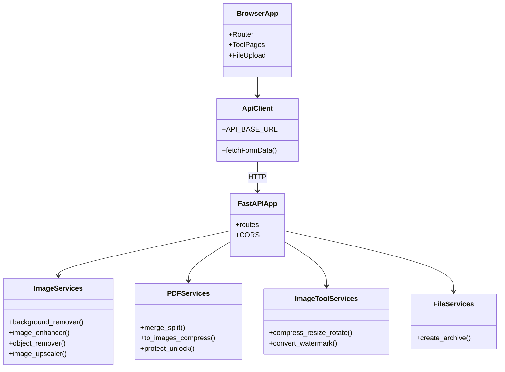
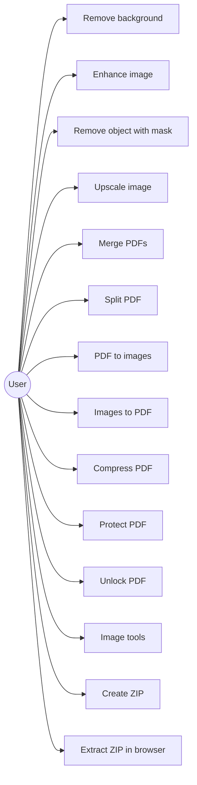
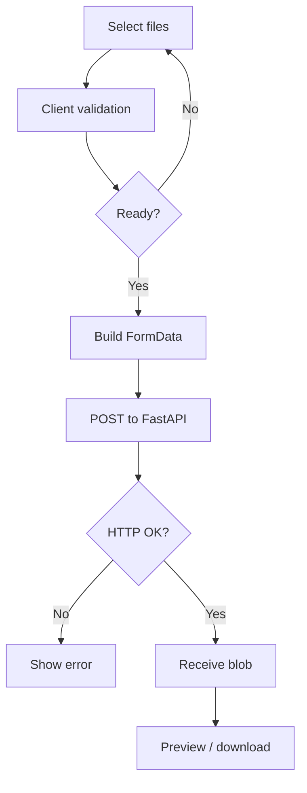
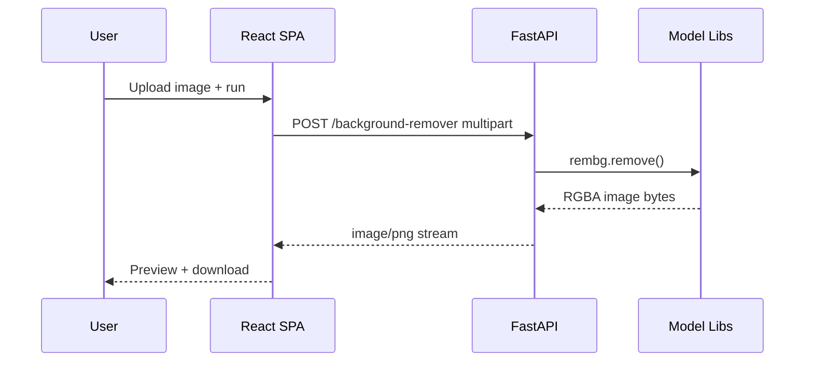
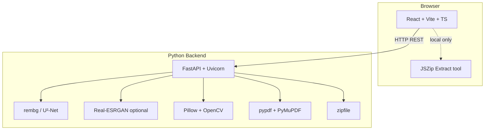

# PureCut Suite — Official Project Documentation (Completed)

**Project status:** Complete — full-stack web application delivered with AI image tools, PDF utilities, image manipulation, and file archive features.

**Document version:** 2.0  
**Last updated:** March 29, 2026  

---

## Project Report Organization

This document is structured for academic and technical reporting. Read sections in order for a full narrative, or jump via the table of contents.

1. [Motivation](#1-motivation)  
2. [Problem Statement](#2-problem-statement)  
3. [Project Objectives](#3-project-objectives)  
4. [Abstract](#4-abstract)  
5. [Literature Survey](#5-literature-survey)  
6. [Existing Work](#6-existing-work)  
7. [Limitations of Existing Work](#7-limitations-of-existing-work)  
8. [Software & Hardware Specifications](#8-software--hardware-specifications)  
9. [Proposed System Design](#9-proposed-system-design)  
10. [Proposed Methods](#10-proposed-methods)  
11. [Diagrams](#11-diagrams)  
    - [Class Diagram](#111-class-diagram-conceptual)  
    - [Use Case Diagram](#112-use-case-diagram)  
    - [Activity Diagram](#113-activity-diagram)  
    - [Sequence Diagram](#114-sequence-diagram)  
    - [System Architecture](#115-system-architecture)  
12. [Technology Description](#12-technology-description)  
13. [Models, Libraries, and Tool Mapping](#13-models-libraries-and-tool-mapping)  
14. [Implementation & Testing](#14-implementation--testing)  
15. [Conclusion & Future Scope](#15-conclusion--future-scope)  
16. [References](#16-references)  
17. [Appendix](#17-appendix)  

---

## 1. Motivation

Individuals and small teams routinely need to remove backgrounds, upscale images, manipulate PDFs, and convert or compress assets. Cloud SaaS tools are convenient but upload user files to third parties; desktop suites are powerful but costly and heavy. A **self-hosted, browser-based suite** that runs processing on infrastructure the user controls aligns with privacy expectations, predictable costs, and repeatable workflows—especially for sensitive documents and creative assets.

PureCut Suite was motivated by the need for a **single, cohesive interface** that combines **modern deep-learning models** where they add real value with **classical, fast algorithms** where they suffice, all behind a **local FastAPI backend** and a **React** front end.

---

## 2. Problem Statement

**Problem:** There is no single, lightweight, privacy-preserving web application in the project scope that:

- Offers AI-assisted image operations (segmentation, upscaling) and classical image/PDF operations in one product.  
- Keeps data on the user’s machine or LAN by default (no mandatory third-party API).  
- Remains usable without specialized training, with clear upload → process → download flows.  
- Degrades gracefully when optional heavy models (e.g., Real-ESRGAN weights) are missing.

**Solution:** PureCut Suite — a React + TypeScript SPA talking to a Python FastAPI service that implements REST endpoints for each tool, using **rembg (U²-Net)**, **Real-ESRGAN (optional)**, **OpenCV**, **Pillow**, **pypdf**, and **PyMuPDF** as appropriate.

---

## 3. Project Objectives

| ID | Objective |
|----|-----------|
| O1 | Deliver a **privacy-first** workflow: processing on the user-controlled backend, not on external AI APIs. |
| O2 | Provide **AI tools**: background removal, enhancement, object removal (inpainting), upscaling with **documented models** and fallbacks. |
| O3 | Provide **PDF tools**: merge, split, page count, PDF→images, images→PDF, compress, protect (AES-256), unlock. |
| O4 | Provide **image tools**: compress, convert, resize, rotate/flip, watermark. |
| O5 | Provide **file tools**: create ZIP archives (backend); list/extract ZIP contents (browser, JSZip). |
| O6 | Ensure **responsive UI**, drag-and-drop uploads, progress feedback, and error handling. |
| O7 | Support **LAN/mobile access** via configurable API base URL (`src/config/api.ts`). |
| O8 | Keep the system **maintainable**: typed frontend, clear FastAPI routes, stateless API (no DB required for core features). |

---

## 4. Abstract

PureCut Suite is a completed web application that bundles **AI-powered** and **classical** image processing with **PDF** and **archive** utilities. The frontend is a **Vite + React + TypeScript** single-page application using **Tailwind CSS** and **shadcn/ui** (Radix primitives). The backend is **FastAPI** on **Python 3.11+**, exposing REST endpoints that accept multipart uploads and return images, PDFs, or ZIP files. Heavy models (**U²-Net** via **rembg**, **Real-ESRGAN** via **realesrgan** / **BasicSR**) are used only where they outperform classical methods; otherwise **Pillow**, **OpenCV**, **pypdf**, and **PyMuPDF** keep latency and dependencies low. The product is suitable for local development, LAN deployment, or production behind a reverse proxy with tightened CORS and rate limits.

---

## 5. Literature Survey

- **Salient object detection & segmentation:** U-Net architectures and variants (e.g., **U²-Net**, Qin et al., 2020) excel at producing masks for foreground extraction, which underpins automatic background removal.  
- **Super-resolution:** **Real-ESRGAN** (Wang et al., 2021) improves real-world degradations using a **RRDBNet** generator; it is widely used for photo restoration.  
- **Inpainting:** **Telea’s fast marching method** (Telea, 2004), implemented as `cv2.INPAINT_TELEA` in OpenCV, fills user-specified regions from boundary information—fast and suitable for moderate-sized removals when a mask is provided.  
- **PDF engineering:** The PDF ecosystem is served by libraries such as **pypdf** (structure, merge, encryption) and **PyMuPDF** (rendering, rasterization, aggressive size reduction).  
- **Web delivery:** **ASGI** frameworks (FastAPI) and **async** I/O suit upload-heavy workloads; **SPA** frameworks (React) enable rich interactive tooling in the browser.

---

## 6. Existing Work

| Category | Examples | Role |
|----------|----------|------|
| Cloud SaaS | Remove.bg, TinyPNG, ILovePDF | Hosted APIs; upload data to vendor. |
| Desktop | Photoshop, Acrobat, GIMP | High capability; cost and learning curve. |
| CLI | ImageMagick, pdftk, Ghostscript | Powerful; poor fit for non-technical users. |
| Open-source libraries | rembg, Real-ESRGAN, OpenCV, Pillow | Building blocks; not a unified product by themselves. |

PureCut Suite **composes** these open building blocks into a **single UX** with a defined API surface and frontend.

---

## 7. Limitations of Existing Work

- **SaaS:** Privacy, quotas, pricing, and offline use are recurring issues.  
- **Desktop suites:** License cost, installation, and overkill for batch resize/merge-type tasks.  
- **CLI:** Requires expertise; weak discoverability for occasional users.  
- **Raw libraries:** Developers must integrate models, pre/post-processing, and security—PureCut Suite addresses integration and UX for a fixed tool set.

---

## 8. Software & Hardware Specifications

### 8.1 Software Requirements

**Client (browser)**

- Modern evergreen browser: **Chrome 90+**, **Firefox 88+**, **Safari 14+**, **Edge 90+**  
- JavaScript enabled  

**Frontend development & build**

- **Node.js** 18+ (LTS recommended)  
- **npm** 9+  
- **Vite** 5.x, **React** 18.x, **TypeScript** 5.x  

**Backend runtime**

- **Python** 3.11+ (3.11 tested; 3.12+ generally compatible)  
- **pip** and a virtual environment  

**Backend dependencies (pinned in `backend/requirements.txt`)**

| Package | Version | Purpose |
|---------|---------|---------|
| fastapi | 0.115.0 | HTTP API framework |
| uvicorn[standard] | 0.30.6 | ASGI server |
| python-multipart | 0.0.9 | Multipart uploads |
| Pillow | 10.4.0 | Image I/O, transforms, PDF rasterization helpers |
| numpy | 2.1.2 | Arrays for OpenCV / ML |
| rembg | 2.0.57 | Background removal (**U²-Net** family models) |
| realesrgan | 0.3.0 | Real-ESRGAN inference wrapper |
| opencv-python | 4.10.0.84 | Inpainting, color ops |
| pypdf | 5.1.0 | Merge, split, encrypt, decrypt |
| PyMuPDF | 1.24.10 | Render PDF pages, compress pipeline |

**Optional weights (upscaler):** place **`RealESRGAN_x2plus.pth`** under `backend/weights/` (path expected by `app.py`). If missing or initialization fails, upscaling **falls back** to bicubic resize.

**Frontend notable libraries**

- **react-router-dom** — routing  
- **react-dropzone** — uploads  
- **framer-motion** — UI motion  
- **@tanstack/react-query** — async/server state  
- **jszip** — ZIP listing/extraction in **Extract Files** tool (browser-only)  
- **Radix UI** + **tailwindcss** — accessible components and styling  

### 8.2 Hardware Requirements

**Minimum (CPU-only, local use)**

- CPU: 2+ cores, ~2.0 GHz  
- RAM: **8 GB** (4 GB may work for light tools; **rembg** and PDF rasterization benefit from more headroom)  
- Disk: ~**10 GB** free (dependencies + model caches; **U²-Net** weights via rembg are large)  
- GPU: optional  

**Recommended (AI-heavy workflows)**

- CPU: 4+ cores  
- RAM: **16 GB**  
- SSD for model and I/O  
- **NVIDIA GPU with CUDA** for Real-ESRGAN inference (optional; CPU fallback possible but slow)  

**Client device**

- Any device capable of running a modern browser; large images and ZIPs benefit from adequate RAM.

---

## 9. Proposed System Design

### 9.1 High-Level Design

- **Presentation:** React SPA, tool pages per feature, shared layout and upload components.  
- **Application API:** FastAPI routes, one responsibility per endpoint, `StreamingResponse` for binaries.  
- **Processing:** Stateless request handlers; no session database. Files exist only in memory during a request.  
- **Cross-cutting:** CORS middleware (development-oriented defaults in code—**must be restricted in production**); health check at `GET /health`.

### 9.2 Functional Scope (Tool → Backend)

| Area | Tool | Primary implementation |
|------|------|-------------------------|
| AI | Background remover | `rembg.remove()` → U²-Net–style model |
| AI | Image enhancer | Pillow filters + enhancements |
| AI | Object remover | OpenCV `INPAINT_TELEA` + user mask |
| AI | Upscaler | Real-ESRGAN (`RRDBNet` + `RealESRGANer`) or bicubic fallback |
| PDF | Merge, split, page count, protect, unlock | pypdf |
| PDF | To images, compress | PyMuPDF (fitz) |
| PDF | From images | Pillow (multi-image PDF) |
| Image | Compress, resize, rotate, convert, watermark | Pillow (+ NumPy/OpenCV as needed) |
| File | Create archive | Python `zipfile` |
| File | Extract / preview ZIP | JSZip in browser (no backend endpoint) |

---

## 10. Proposed Methods

- **Background removal:** Semantic segmentation via **rembg** (default model ecosystem based on **U²-Net** research; packaged for ease of use). *Why:* Strong general-purpose matting without custom training. *Source:* PyPI package `rembg`; model artifacts downloaded/cached by the library.  
- **Enhancement:** **Median filter**, **unsharp mask**, **ImageEnhance** sharpness/contrast/brightness. *Why:* Fast, deterministic, no GPU requirement.  
- **Object removal:** **Telea inpainting** with a binary mask. *Why:* Lightweight; suitable for small/medium regions; no extra DL model.  
- **Upscaling:** **Real-ESRGAN** with **RRDBNet** (x2plus weights). *Why:* State-of-the-art perceptual quality on real images. *Fallback:* bicubic if weights or deps unavailable.  
- **PDF merge/split/encrypt:** **pypdf** — standard Python PDF toolkit.  
- **PDF rasterization & aggressive compression:** **PyMuPDF** — fast C library, good control over DPI and JPEG quality.  
- **Archives:** **zipfile** (create); **JSZip** (read client-side for extract UI).

---

## 11. Diagrams

### 11.1 Class Diagram (Conceptual)

High-level structural view of major components (not every TypeScript class).

### 11.2 Use Case Diagram

### 11.3 Activity Diagram (Typical tool flow)

### 11.4 Sequence Diagram (AI tool example)

### 11.5 System Architecture

---

## 12. Technology Description

### 12.1 Frontend Stack

- **Vite:** Fast dev server and optimized production bundles.  
- **React 18:** Component model, hooks, concurrent features.  
- **TypeScript:** Type safety for maintainability.  
- **Tailwind CSS + shadcn/ui:** Consistent design system and accessible primitives.  
- **Framer Motion:** Polished transitions.  
- **react-dropzone:** Drag-and-drop UX.  

### 12.2 Backend Stack

- **FastAPI:** OpenAPI-friendly, async-capable, ergonomic validation.  
- **Uvicorn:** Production ASGI server.  

### 12.3 API Base URL Behavior

`src/config/api.ts` sets **`http://127.0.0.1:8000`** on localhost and **`http://<hostname>:8000`** when accessed from another device on the network so phones on the same LAN can reach the backend when it is bound to `0.0.0.0`.

---

## 13. Models, Libraries, and Tool Mapping

This section lists **what** each tool uses, **where it comes from**, and **why it was chosen**.

### 13.1 AI / Vision Models & Algorithms

| Tool | Model / algorithm | Source / upstream | Why chosen |
|------|-------------------|-------------------|------------|
| **Background remover** | **U²-Net–class** salient-object model (bundled inside **rembg**) | PyPI: **`rembg`**; research: Qin et al., *U²-Net* (2020) | Strong general-purpose segmentation; simple API (`remove()`); widely adopted. |
| **Image enhancer** | Median filter, unsharp mask, PIL enhancements | **Pillow** | No GPU; predictable; sub-second on typical photos. |
| **Object remover** | **Fast Marching / Telea** inpainting | **OpenCV** `cv2.inpaint(..., INPAINT_TELEA)`; Telea (2004) | No extra DL weights; mask-driven workflow matches UI. |
| **Upscaler** | **Real-ESRGAN** (**RRDBNet** generator) | PyPI: **`realesrgan`**, **`basicsr`** (transitive); weights: **RealESRGAN_x2plus.pth** (e.g., official Real-ESRGAN releases) | Best-effort real-world SR; optional with **bicubic** fallback in code. |

**Note:** `rembg` may download/cache its default model on first run—plan disk space and first-run latency.

### 13.2 PDF & Document Stack

| Tool | Library | Source | Why chosen |
|------|---------|--------|------------|
| Merge, split, page count, protect, unlock | **pypdf** | PyPI | Pure Python, solid for merge/split and AES-256 encryption. |
| PDF → images, PDF compress | **PyMuPDF (fitz)** | PyPI | Fast rendering; DPI control; rasterize pages for compression. |
| Images → PDF | **Pillow** | PyPI | Multi-image PDF export without extra native deps. |

### 13.3 Image Tools (non-AI)

All implemented with **Pillow** (and **NumPy** where needed): compress (ZIP output), resize, rotate/flip, convert (ZIP batch), watermark (text or image overlay).

### 13.4 File Tools

| Tool | Where it runs | Mechanism |
|------|----------------|-----------|
| **Create archive (ZIP)** | Backend | Python **`zipfile`** → `/file/create-archive` |
| **Extract / list ZIP** | Browser | **`jszip`** — keeps extraction local without uploading archive contents to the server |

---

## 14. Implementation & Testing

### 14.1 Implementation Summary

- **Backend:** Single `backend/app.py` module registering all routes; helpers for image load, PDF streaming, ZIP responses, and safe archive names.  
- **Frontend:** Route per tool under `src/pages/` (AI, PDF, Image, File categories); shared `ToolLayout`, `FileUpload`, and `API_BASE_URL` usage.  
- **Stateless design:** No database; each request is independent.  
- **Optional dependencies:** Real-ESRGAN stack is **optional** in the sense that import failures and runtime errors trigger **bicubic** upscaling so the endpoint still returns an image.

### 14.2 Security & Production Notes

- Current CORS settings in `app.py` are permissive (`allow_origins=["*"]`) for development and LAN access. **For internet-facing deployment**, restrict origins, add **rate limiting**, **authentication** where needed, and **HTTPS** via a reverse proxy.  
- ZIP extraction is **client-side** with path sanity checks to reduce zip-slip style issues when extracting in the browser.

### 14.3 Testing (Recommended / Performed)

| Layer | Suggested tests |
|-------|-----------------|
| Backend | `pytest` + `httpx` `AsyncClient` for endpoints; golden-file checks on small PNG/PDF fixtures. |
| Frontend | Component tests (RTL), E2E (Playwright) for critical flows. |
| Manual | Verify each tool with sample files; verify upscaler with and without weights. |

**Completed project deliverable:** application code and this documentation; formal automated test suite can be added as a follow-on quality task.

---

## 15. Conclusion & Future Scope

**Conclusion:** PureCut Suite meets its objectives: a **completed**, **modular** web suite combining **documented DL models** (where appropriate) with **classical** and **library-based** PDF/image processing, **privacy-oriented** local processing, and a **modern** TypeScript UI. Optional GPU acceleration improves Real-ESRGAN throughput; rembg and PyMuPDF benefit from adequate RAM and CPU.

**Future scope**

- Hardening: **strict CORS**, **JWT or API keys**, **rate limiting**, request size limits, structured logging.  
- GPU path: container with CUDA for Real-ESRGAN; batching and job queue for long tasks.  
- Testing: CI with API smoke tests and frontend E2E.  
- Features: additional inpainting models, OCR, user accounts, job history (requires DB).  
- Packaging: Docker Compose for one-command local deployment.

---

## 16. References

1. Qin, X., et al. (2020). *U²-Net: Going Deeper with Nested U-Structure for Salient Object Detection.* Pattern Recognition.  
2. Wang, X., et al. (2021). *Real-ESRGAN: Training Real-World Blind Super-Resolution with Pure Synthetic Data.* ICCV Workshops.  
3. Telea, A. (2004). *An Image Inpainting Technique Based on the Fast Marching Method.* Journal of Graphics Tools.  
4. FastAPI. https://fastapi.tiangolo.com/  
5. React. https://react.dev/  
6. rembg (Python package). https://github.com/danielgatis/rembg  
7. Real-ESRGAN (official repo). https://github.com/xinntao/Real-ESRGAN  
8. Pillow. https://pillow.readthedocs.io/  
9. OpenCV. https://docs.opencv.org/  
10. pypdf. https://pypdf.readthedocs.io/  
11. PyMuPDF. https://pymupdf.readthedocs.io/  
12. JSZip. https://stuk.github.io/jszip/  

---

## 17. Appendix

### Appendix A — Source Code

- **Repository / workspace:** `purecut-suite` (this project).  
- **Key paths:** `backend/app.py`, `backend/requirements.txt`, `src/`, `src/config/api.ts`.  

### Appendix B — Optional: Published Paper Links

- U²-Net: https://arxiv.org/abs/2005.09007  
- Real-ESRGAN: https://arxiv.org/abs/2108.11006  

### Appendix C — Real-ESRGAN Weights

- Expected filename in code: `backend/weights/RealESRGAN_x2plus.pth`.  
- Obtain from the official Real-ESRGAN release assets or model zoo; verify license for your use case.

---

*End of document.*
